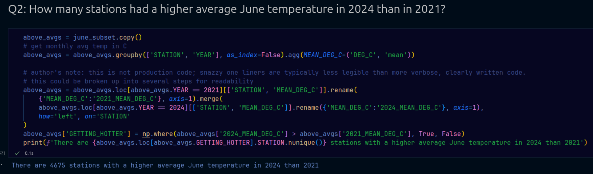
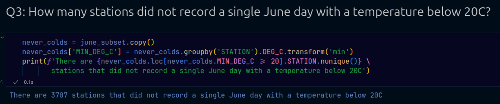

# Analyzing Sample Weather Statistics

This repository demonstrates a classic end-to-end data transformation and analytics workflow.  

The goal was to process a large collection (~50,000) of raw CSV files containing temperature and other meteorological readings from approximately 12,000 weather stations. The process involved ingesting, validating, standardizing, and analyzing the data to uncover meaningful insights.

## Step 1: Data Ingestion

Initially, I used Python’s `tarfile` library in `main.py` to decompress the input archive, but this approach was too time-intensive. Instead, I extracted the files using Bash, then looped through each file to check for the required schema. Valid files were appended and combined into a single clean dataset. Basic data cleaning removed missing or incomplete records. The resulting dataset was saved to disk as a CSV and loaded into a Jupyter Notebook for further exploration.  

I used `Pytest` to ensure the input files matched the expected schemas.

## Step 2: Cleaning and Analysis

The raw data was read into a Jupyter Notebook. A subset of relevant columns and date ranges were selected and the rest dropped to save memory. After checking for sparsity in the raw data (particularly on station names), questions are answered regarding station temperature patterns and trends.

## Key Insights

1. Top stations with the highest number of June days over 30°C.  

3. Comparison of average June temperatures between 2021 and 2024.

5. Stations consistently recording warm temperatures with no June days below 20°C.

## Project Reflection

This was an excellent exercise in handling large-scale file ingestion and data validation. While my initial plan was to fully automate decompression, switching to Bash extraction significantly reduced runtime, though it introduced a manual step that would need revisiting for true scalability.  

For larger datasets or longer time spans, I would explore parallelized unpacking and processing, or move to stream processing to reduce disk and memory overhead. I would also swap out the final CSV for a local DuckDB database to improve query speed and memory efficiency.  

Finally, while the Jupyter Notebook worked well for this ad hoc analysis, building repeatable dashboards or automated reports would require a more robust data modeling strategy and an appropriate storage layer.  

Thanks for reading!  
**Chris Adan**  
[Find me on LinkedIn](https://www.linkedin.com/in/chrisadan/)  
[Read on Medium](https://upandtothewrite.medium.com/)
